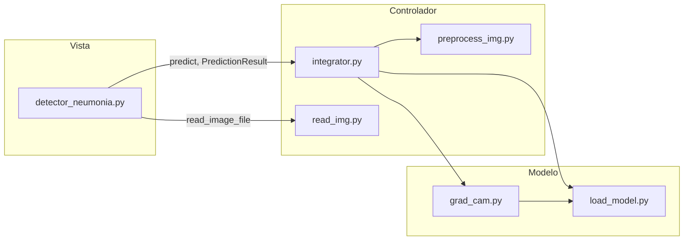

# UAO-Neumonia — Detector de Neumonía con Grad-CAM


---

> ## ⚠️ DESCARGO DE RESPONSABILIDAD MÉDICA
> Esta herramienta es un **proyecto educativo de apoyo académico** desarrollado en el marco
> de una especialización en Inteligencia Artificial. **NO es un dispositivo médico
> certificado**, no ha sido validado clínicamente, y **no debe usarse para diagnóstico,
> tratamiento o toma de decisiones clínicas reales**. Todo resultado que produzca debe ser
> interpretado exclusivamente en un contexto de enseñanza y siempre bajo supervisión de un
> profesional de la salud calificado. Ver `docs/MODEL_CARD.md` para las limitaciones
> conocidas del modelo, incluido un hallazgo de posible error de clasificación aún bajo
> investigación.

---

## Descripción del proyecto

`UAO-Neumonia` clasifica radiografías de tórax (DICOM o JPG/PNG) en tres categorías,
usando una CNN (basada en Pasa et al., *Efficient Deep Network Architectures for Fast
Chest X-Ray Tuberculosis Screening and Visualization*) y explica cada predicción con
**Grad-CAM** (Selvaraju et al., *Grad-CAM: Visual Explanations from Deep Networks via
Gradient-based Localization*), superponiendo un mapa de calor sobre la región de la
imagen que más influyó en la decisión del modelo.

| Clase (índice) | Etiqueta | Estado del mapeo |
|---|---|---|
| 0 | Neumonía bacteriana | ⚠️ heredado del código original, en verificación (ver Model Card) |
| 1 | Normal (sin neumonía) | ⚠️ heredado del código original, en verificación (ver Model Card) |
| 2 | Neumonía viral | ⚠️ heredado del código original, en verificación (ver Model Card) |

## Arquitectura MVC

| Capa | Módulos | Responsabilidad |
|---|---|---|
| **Modelo** | `src/load_model.py`, `src/grad_cam.py` | Carga/caché de la CNN (`.h5`), cálculo del mapa Grad-CAM y del overlay. Único lugar del repo donde vive TensorFlow/Keras. |
| **Controlador** | `src/read_img.py`, `src/preprocess_img.py`, `src/integrator.py` | Lectura de DICOM/JPG, pipeline de preprocesamiento y orquestación (única puerta de entrada de la Vista). |
| **Vista** | `src/detector_neumonia.py` | Interfaz Tkinter. Solo importa `integrator` y `read_img`. Cero lógica de negocio, cero TensorFlow. |



Detalle completo del flujo de datos y la "regla de dependencias" en [`docs/ARCHITECTURE.md`](docs/ARCHITECTURE.md).

## Requisitos previos

- **UV** ≥ 0.5 ([instalación oficial](https://docs.astral.sh/uv/getting-started/installation/)).
- **Python 3.13** (UV lo instala automáticamente si no lo tienes: `uv python install 3.13`).
- **Docker Desktop** (opcional, para el modo contenedor).
- El archivo del modelo **`conv_MLP_84.h5`** (no está en el repositorio, ver sección siguiente).

## Instalación (solo con `uv`, sin `pip`)

```bash
git clone https://github.com/ORG/UAO-Neumonia.git
cd UAO-Neumonia

uv python install 3.13     # si no tienes Python 3.13
uv sync                    # crea .venv y resuelve uv.lock

uv run ruff check .        # -> All checks passed!
uv run pytest -m "not requires_model and not gui" -q   # -> N passed
```

> `pip install` está prohibido en este proyecto. Cualquier dependencia nueva se añade con
> `uv add <paquete>` (o `uv add --group dev <paquete>` para herramientas de desarrollo).

## Obtención del modelo y verificación de integridad

`conv_MLP_84.h5` está excluido por `.gitignore` (ver `models/README.md`). Colócalo en
`models/conv_MLP_84.h5` o define la variable de entorno `MODEL_PATH`:

```bash
export MODEL_PATH=/ruta/a/conv_MLP_84.h5          # Linux/macOS
$env:MODEL_PATH = "C:\ruta\a\conv_MLP_84.h5"      # Windows PowerShell

uv run python -c "from load_model import compute_sha256; print(compute_sha256('$MODEL_PATH'))"
```

Compara el resultado contra el SHA256 publicado en `docs/MODEL_CARD.md` (sección
"Procedencia"). **Nota:** ese valor está marcado `No disponible` hasta que se traslade
desde `docs/handoffs/HANDOFF-H0.md` — no lo asumas sin verificarlo tú mismo.

## Uso

### GUI (Tkinter)

```bash
uv run python src/detector_neumonia.py
# o
make run          # Linux/macOS
make.bat run      # Windows
```

Flujo: cargar imagen → Predecir → revisar clase/probabilidad/mapa de calor → Guardar
(CSV) o exportar PDF.

### CLI de smoke test (sin GUI)

```bash
uv run python scripts/smoke_test.py --dry-run                 # sin modelo real
uv run python scripts/smoke_test.py --image ruta/a/imagen.dcm # con modelo real
```

### Docker

```bash
# Linux / macOS
docker build -t neumonia:1.0.0 .
xhost +local:docker
docker run --rm -e DISPLAY=$DISPLAY -v /tmp/.X11-unix:/tmp/.X11-unix \
  -v "$(pwd)/models:/models:ro" -e MODEL_PATH=/models/conv_MLP_84.h5 neumonia:1.0.0

# Windows (requiere VcXsrv/XLaunch escuchando en :0.0 con "Disable access control")
docker run --rm -e DISPLAY=host.docker.internal:0.0 `
  -v "${PWD}\models:/models:ro" -e MODEL_PATH=/models/conv_MLP_84.h5 neumonia:1.0.0
```

Troubleshooting X11 y detalles de la imagen multi-stage en el propio `Dockerfile` y en
`docs/ARCHITECTURE.md`.

## Estructura de archivos

src/
├── config.py # constantes y rutas (MODEL_PATH, CLASS_LABELS, IMAGE_SIZE)
├── read_img.py # Controlador — lectura DICOM/JPG -> (RGB uint8, PIL.Image)
├── preprocess_img.py # Controlador — resize/gris/CLAHE/normalización/batch
├── load_model.py # Modelo — carga cacheada del .h5 + SHA256
├── grad_cam.py # Modelo — heatmap + overlay
├── integrator.py # Controlador — única puerta de entrada de la Vista
└── detector_neumonia.py # Vista — GUI Tkinter


## Pipeline de preprocesamiento (resumen)

`read_img` → resize a 512×512 → escala de grises → ecualización CLAHE
(`clip_limit=2.0`, `tile_grid=(4,4)`) → normalización [0,1] → batch
`(1, 512, 512, 1)` float32. Detalle paso a paso en
[`docs/PIPELINE.md`](docs/PIPELINE.md).

## Grad-CAM (resumen)

Grad-CAM calcula el gradiente de la clase predicha respecto a la última capa
convolucional, pondera los mapas de activación con esos gradientes y genera un mapa de
calor 512×512 que se superpone (JET, `alpha=0.4`) sobre la radiografía original. Ver
fundamento matemático y limitaciones en `docs/MODEL_CARD.md` y en el paper original de
Selvaraju et al.

## Testing y calidad

```bash
uv run ruff check .                                  # lint
uv run ruff format --check .                         # formato
uv run pytest -m "not requires_model and not gui" -q # tests sin modelo/GUI
uv run pytest --cov=src -q                            # cobertura (fail_under=80)
uv run python scripts/audit_docs.py                   # auditoría de docstrings/type hints
uv run python scripts/check_warnings.py                # 0 warnings en src/
make verify                                            # lint + format-check + test
```

## Flujo de contribución (Gitflow)

1. Ramifica desde `develop`: `feature/<nombre-módulo>`.
2. Commits pequeños y descriptivos; nunca se commitea directo en `develop`.
3. Abre PR usando `.github/pull_request_template.md`, marca la capa MVC afectada.
4. **Revisión cruzada obligatoria**: el aprobador debe ser distinto del autor.
5. CI en verde (lint + tests, y build de Docker en PRs que lo afecten) antes de mergear.
6. `Squash and merge` a `develop`; borra la rama tras el merge.
7. Releases: `release/x.y.z` → PR a `main` → tag.

## Créditos

- Autores de esta refactorización MVC: equipo del curso de Especialización en IA (UAO).
- Proyecto original: **Isabella Torres Revelo** ([@isa-tr](https://github.com/isa-tr)) y
  **Nicolás Díaz Salazar** ([@nicolasdiazsalazar](https://github.com/nicolasdiazsalazar)).
- Arquitectura CNN basada en: Pasa, F., Golkov, V., Pfeifer, F., Cremers, D., & Pfeifer, D.
  *Efficient Deep Network Architectures for Fast Chest X-Ray Tuberculosis Screening and
  Visualization*.
- Interpretabilidad: Selvaraju, R. R., et al. *Grad-CAM: Visual Explanations from Deep
  Networks via Gradient-based Localization*.

## Licencia

Proyecto de uso académico desarrollado en el marco de una Especialización en Inteligencia
Artificial. Ver archivo `LICENSE` en la raíz del repositorio para los términos exactos.