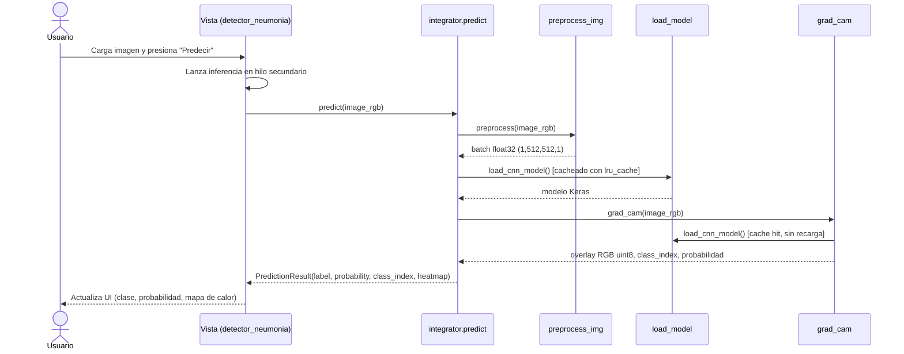
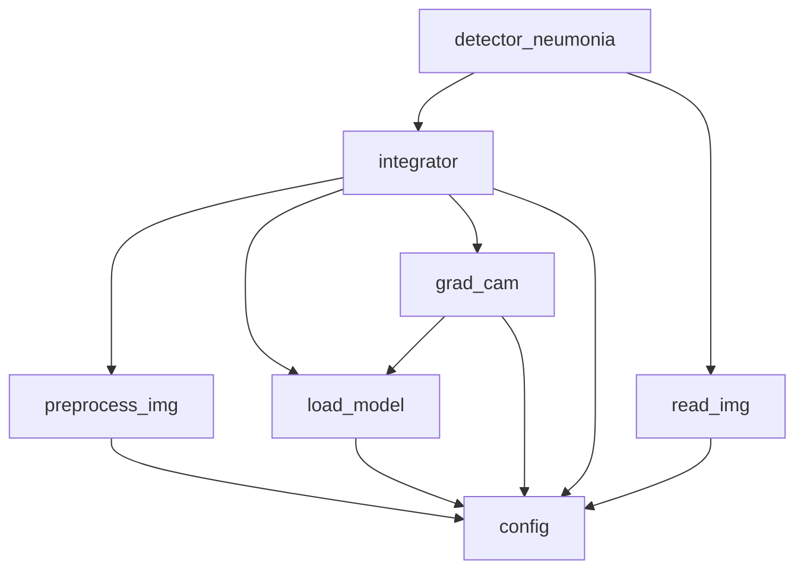

# Arquitectura — UAO-Neumonia

> ⚠️ Herramienta de apoyo educativo, no es un dispositivo médico certificado.

## 1. Diagrama de secuencia (flujo de una predicción)

## 2. Diagrama de dependencias entre módulos

## 3. Justificación del diseño

**`integrator.py` como única puerta de entrada.** La Vista no debe conocer si una
predicción requiere preprocesamiento, carga de modelo o cálculo de Grad-CAM: solo conoce
`predict(image_rgb) -> PredictionResult`. Esto permite que cualquiera de los tres pasos
internos cambie (por ejemplo, sustituir el modelo o el algoritmo de explicabilidad) sin
tocar una sola línea de la GUI, y es lo que hace posible cumplir la regla MVC "la Vista no
importa TensorFlow ni Keras".

**Por qué el modelo se cachea (`@lru_cache(maxsize=1)` en `load_cnn_model`).** Cargar
`conv_MLP_84.h5` toma entre 0.6 s y 4.5 s (medido empíricamente en H8 con el modelo real).
Sin caché, cada clic en "Predecir" repetiría esa carga, degradando la experiencia de uso
interactivo de la GUI. Con caché, la carga ocurre una sola vez por proceso y las
predicciones subsiguientes solo pagan el costo de la inferencia y de Grad-CAM.

**Por qué la Vista corre la inferencia en otro hilo.** Tkinter usa un único hilo de
interfaz (`mainloop`); cualquier operación bloqueante ejecutada en ese hilo congela la
ventana. Como la inferencia + Grad-CAM puede tardar varios segundos, `on_predict()`
delega el trabajo pesado a un hilo secundario y actualiza los widgets desde el hilo
principal al recibir el resultado, evitando que la GUI aparente estar "colgada".

## 4. Regla de dependencias y su verificación automática

Regla congelada (sección 1.1 del plan maestro):

- La Vista (`detector_neumonia.py`) **no** importa `tensorflow`, `keras`, `cv2` ni
  `pydicom`.
- Modelo y Controlador (`load_model.py`, `grad_cam.py`, `read_img.py`,
  `preprocess_img.py`, `integrator.py`) **no** importan `tkinter`.
- `detector_neumonia.py` solo puede hacer `from integrator import predict,
  PredictionResult` y `from read_img import read_image_file`.

`tests/test_architecture.py` verifica esto **estáticamente con el módulo `ast`**: recorre
el árbol de sintaxis de cada archivo de `src/`, extrae los nodos `Import`/`ImportFrom` y
falla el test si aparece una importación prohibida, sin necesidad de ejecutar ni importar
el código (por eso corre incluso sin TensorFlow instalado). Esto convierte la regla de
dependencias en un contrato ejecutable, no solo en una convención documentada.